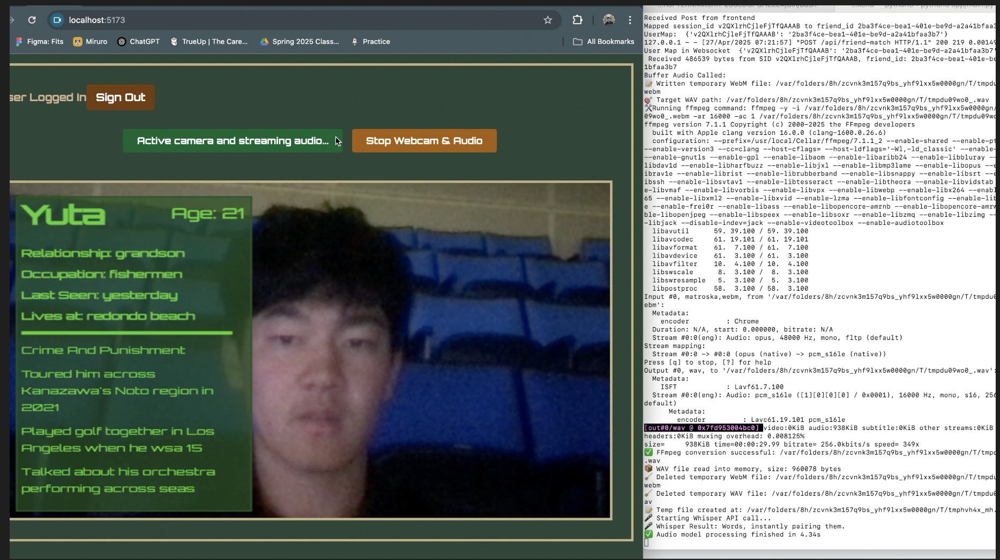

# 🧠 Memorandum

🎥 **Demo Video**: [Watch on YouTube](https://www.youtube.com/watch?v=2MtTPmijZlo)

---

## ✨ Summary 
**Memorandum** is a fullstack web application that helps users **recall past conversations** with individuals currently in their **field of vision**. The app 1) recognizes the individual through a face embedding similarity scoring (face-api.js) then 2) retrieves individual information stored in Supabase (categorical info) and Pinecone (conversational info) and displays to the UI.

The app supports two major flows:
- **1) Information Storage**
- **2) Memory Retrieval**

---

## 🗂️ Storage Flow
1. 📸 The person in the user’s field of vision is **identified** and **recognized** using **face embedding similarity scores** by fast-api.
2. 🎙️ A **real-time conversation** with the identified person is **recorded** and **transcribed** through WebSocketIO, ffmpeg, and OpenAI Whisper.
3. 🧠 The conversation is **processed** via an **LLM** (Llama via Groq client) and **stored** in a **Pinecone Vector Database**.

---

## 🔍 Retrieval Flow
1. 📚 A **query** is called to **Pinecone** to retrieve **past conversation texts**, assisting in **memory recall**.
2. 🧾 A **secondary query** retrieves **immediate facts** (e.g., name, age) about the recognized person from **Supabase**.

---
